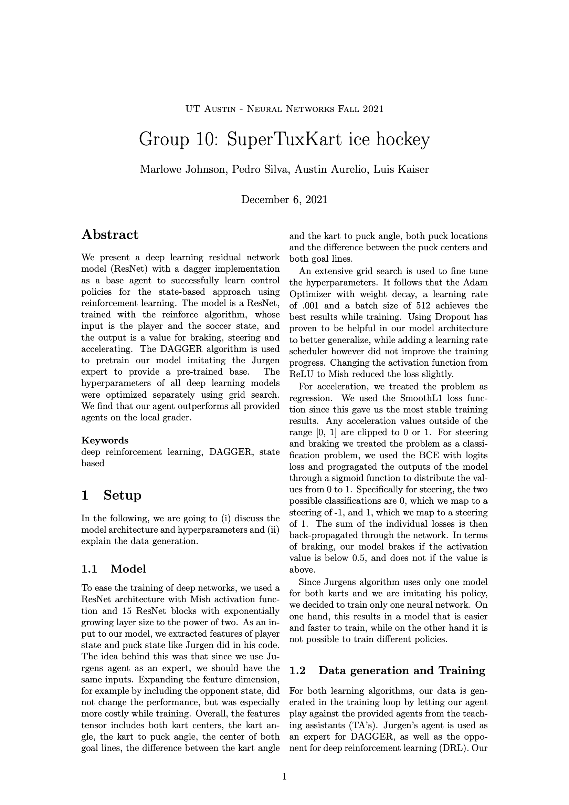

# Deep Ice Hockey Agent

This repository contains the writeup about the final project done for The University of Texas at Austin's CS 342 Neural Network
course in Fall 2021. The Python code is omitted to preserve the integrity of the assignment.
In this project, we built an AI agent that competes in a 2v2 ice hockey game. 

### Abstract

We present a deep learning residual network model (ResNet) with a DAgger implementation as a
base agent to successfully learn control policies for the state-based approach using reinforcement learning.
The model is a ResNet, trained with the reinforce algorithm, whose input is the player and the soccer state,
and the output is a value for braking, steering and accelerating.
The DAgger algorithm is used to pretrain our model imitating an expert to provide a pre-trained base.
The hyperparameters of all deep learning models were optimized separately using grid search.
We find that our agent outperforms all provided agents on the local grader.
   

 

Gameplay showing our agent (blue) playing against the state based TA agent (red). 
The gameplay was done in a modified racing simulator built on SuperTuxKart (https://supertuxkart.net/Main_Page).

 

  

Team members: Austin Aurelio, Pedro Silva, Marlowe Johnson 

